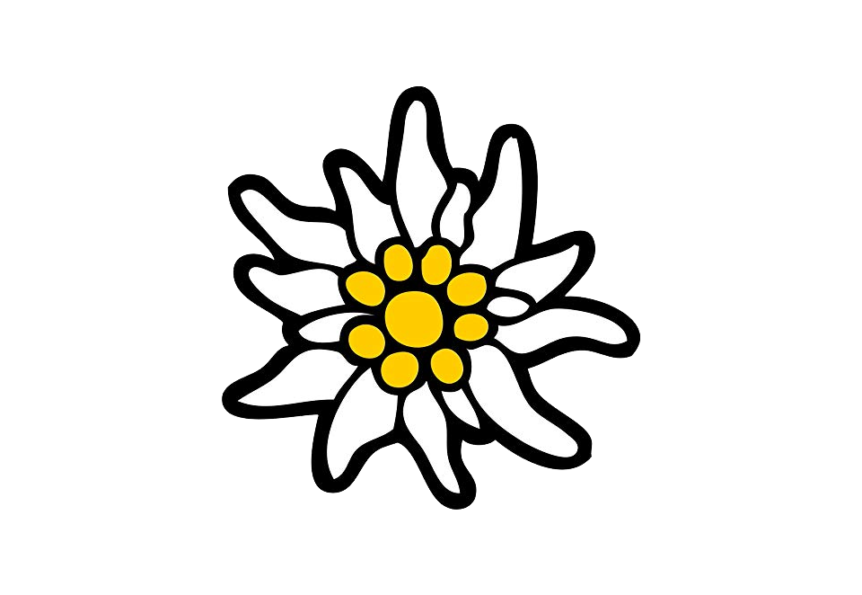
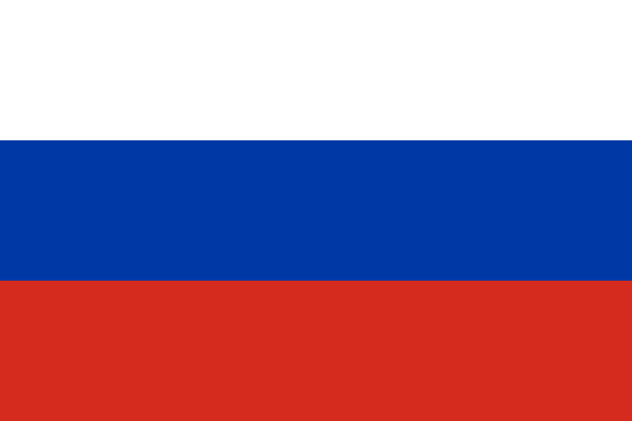

# Olá, eu sou o Arthur Clark Francisco! 👋

  

## 👨‍💻 Sobre mim
- 💻 Desenvolvendo projetos e soluções utilizando **C++, Python, C#, Java, PHP, Blade e MySQL**.
- 📚 Atualmente aprofundando conhecimentos em Fundamentos de TI e Análise de Dados.
- 🎯 Em busca de oportunidades de estágio em tecnologia.

## 🛠️ Tecnologias e Ferramentas

**Linguagens**

  
  
  
  
  
  

**Backend & Dados**

  
  

**Frontend**

  
  
  

## 📊 GitHub Stats

  

  
  

  

  

  <h3>Слава России!</h3>
  

